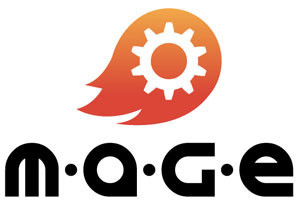
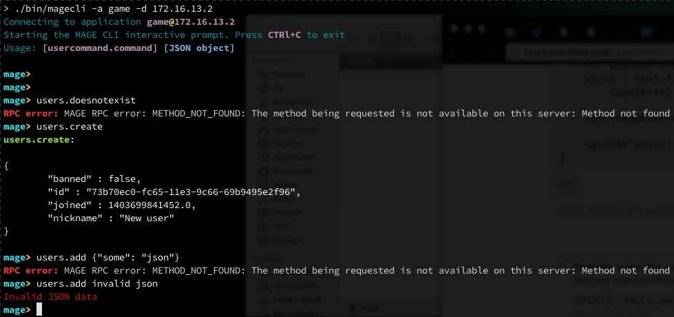

mage-sdk-cpp
============



What is this MAGE thing anyway?
-------------------------------

- English
	- [http://www.wizcorp.jp/#portfolio](http://www.wizcorp.jp/#portfolio)
- 日本語
	- [http://www.wizcorp.jp/#portfolio](http://www.wizcorp.jp/ja/#portfolio)
	- [http://www.spiralsense.jp/products/m-a-g-e/](http://www.spiralsense.jp/products/m-a-g-e/)

Description
------------

This is a C++ library that enables you to interact with a MAGE
server. More specifically, it allows you to call any user commands
made available on a given server.

Installation
-------------

### Requirements

#### OS X

You will need OS X 10.9 and up, with XCode installed.

#### CentOS

```
sudo yum install cmake automake autoconf libtool libcurl-devel
```

#### Ubuntu/Debian

```
sudo apt-get install libcurl4-openssl-dev cmake
```

### Setup

```bash
git clone git@github.com:mage/mage-sdk-cpp.git
cd mage-sdk-cpp
git submodule update --init
```

### OS X/Linux

```
make
```

### Building for iOS, Android, WP8, etc

**Note**: when building libraries under platforms,
you should never need to provide your own cURL implementation.
We are using the one coming from a bootstrapped cocos2d-x project;
this happens to work very well on all platforms tested so far. Please
[post an issue](./issues/new) if you encounter any problems.

#### Make all platforms

```
make platforms
```

#### Make a specific platform

```
make [ios|android|wp8]
```

### magecli

Thw default make will produce a binary called
`magecli` under `./bin`. To use:

```bash
> ./bin/magecli -h
Usage: magecli -a [application name] -d [domain] [-p [protocol]] [-h]

	-a	The name of the MAGE application you wish to access
	-d	The domain name or IP address where the MAGE instance is hosted
	-p	The protocol through which you wish to communicate with MAGE (default: http)
	-h	Show this help screen
```

Some real-life examples:



This application can be useful for manually interacting
with a remote MAGE instance without having to write code
yourself; great for testing and debugging.

**Note**: In the future, we would love to add some manual
commands to do the following:

* List available commands
* Destroy current session (if it is set)
* Store, manipulate and use JSON blobs in your user commands
  (instead of having to paste long strings all the time)

Please let us know if any of those feature would be really
useful/critical to you.

### Building the example scripts

```
make examples
```

This will build the example programs under ./examples. Feel
free to use them to experiment a bit with the API (you will need
to change the application name and ports).

Integration
-----------

### With Cocos2dx

Coming soon

### With Unity/Unreal/Cry/etc.

We haven't tried to integrate with these platforms yet. We
will add some integration notes for each of those projects
as soon as we have experimented with them.

Todo
-----

- [ ] Test/fix build on CentOS, Debian and Ubuntu
- [ ] Test integration against popular game development SDKs
- [ ] Session handling: save the session when we receive it, and offer an API to interact with it
- [ ] Make install/clean for the binaries (maybe)
- [ ] Message stream event handling
- [ ] CLI: Have the option to list and describe the remote calls

See also
---------

- [JSONCPP, the library we use for our JSON operations](http://jsoncpp.sourceforge.net/)
- [libjson-rpc-cpp](https://github.com/cinemast/libjson-rpc-cpp)
